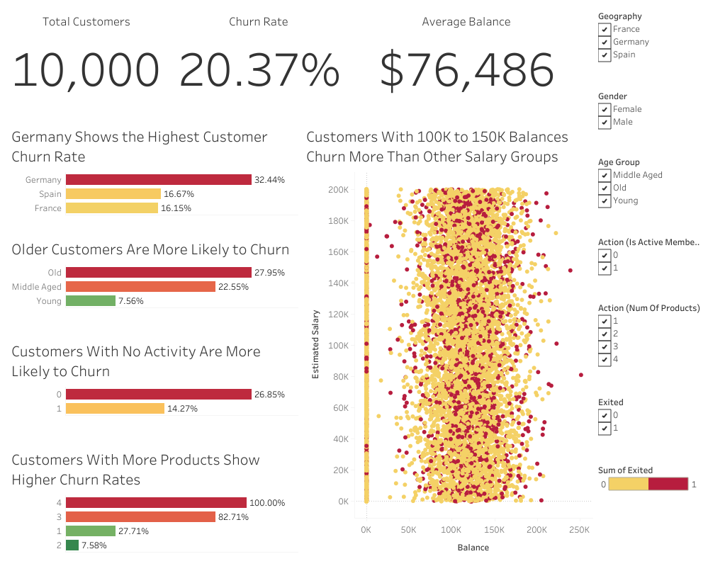

# Bank Customer Churn Analysis

## Project Overview
This project analyzes customer churn behavior for a retail bank using SQL for data analysis and Tableau for visualization. The goal is to identify key drivers of churn and provide actionable business insights.

---

## Project Structure

/data
- churn.csv

/sql
- churn_analysis.sql

/tableau
- churn rate dashboard.twbx
- churn_dashboard_screenshot.png

---

## Data Preparation (SQL)
- Cleaned and structured customer dataset
- Created derived fields such as age groups, credit score groups, and tenure groups
- Ensured data consistency for visualization in Tableau

---

## Key Analyses
- Overall churn rate calculation
- Churn analysis by geography, age group, gender, and activity status
- Customer segmentation based on credit score, tenure, and product usage
- Identification of high-risk customer profiles

---

## Tableau Dashboard
Built an interactive dashboard featuring:
- KPI metrics (Total Customers, Churn Rate, Average Balance)
- Churn breakdown by customer segments
- Behavioral analysis (active vs inactive customers)
- Customer distribution insights

---

## Key SQL Concepts Used
- `COUNT` and `SUM` for aggregations
- `CASE WHEN`
- Subqueries
- CTEs

---

## Dataset
- Source: [(https://www.kaggle.com/datasets/shrutimechlearn/churn-modelling)](https://www.kaggle.com/datasets/shrutimechlearn/churn-modelling)
- Rows:10,000
- Columns: 14

---

## Key Insights
- Inactive members show significantly higher churn rates
- Customers with more products are more likely to churn
- Older customers exhibit higher churn behavior
- Credit score and tenure are strong predictors of retention

---

## Purpose
This project demonstrates end-to-end data analysis skills including data cleaning, exploratory analysis, and data visualization for business decision-making.
